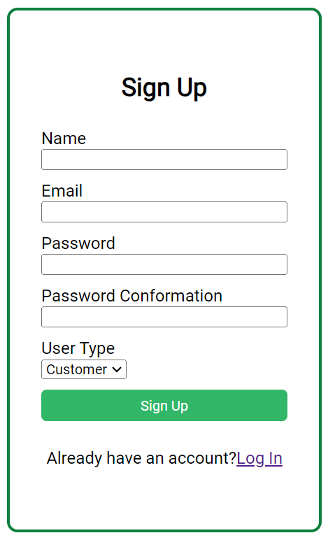

# Store More +

Store More + is an online shopping app catering to three types of users: customers, stores, and delivery personnel. To access the app, users must sign up and select their user type.

## Features
- **Customer:** Browse and purchase products from various stores.
- **Store:** List and manage products, track orders.
- **Delivery:** View and manage delivery tasks.
  
## Current Status
Right now, only the store type user is partially functional. The other user types (customers and delivery) will be completed in the future.

## Getting Started
To get started with Store More +, sign up and choose your user type.

### Website
Access the app [here](https://store-more.netlify.app/).

### Screenshot

### Demo Login
You can log in as a store using the following credentials:
- **Email:** one@one.mail.com
- **Password:** 123456
